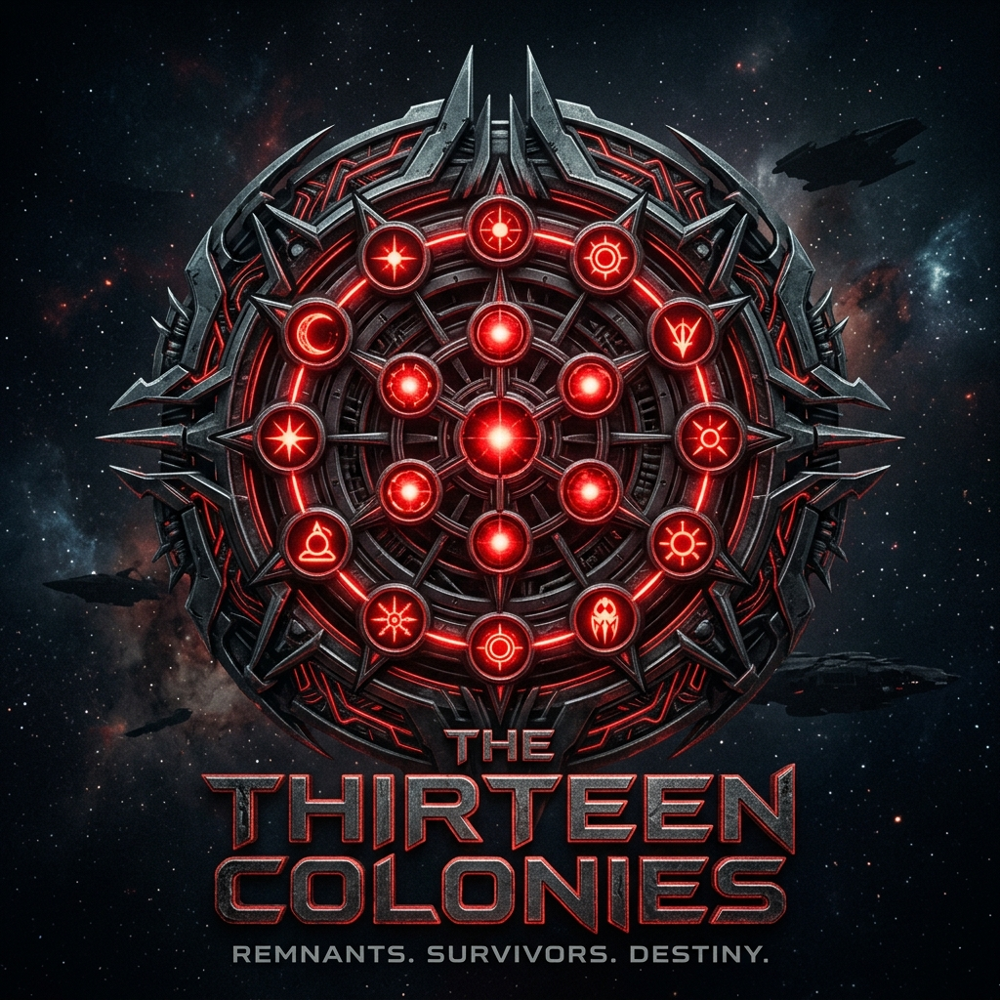

<div align="center">
  
  <h1>Cylon Images</h1>
  <p><em>By your command.</em></p>
</div>


This repository contains the build process and artifacts for generating custom Firecracker MicroVM images.

## Structure

* `/kernel` - Contains the Linux Kernel build definition (compiles `vmlinux`).
* `/rootfs` - Contains the base Operating System user-space (`ext4` rootfs via OCI builds).

> **Note**:
> Kernel source: https://github.com/firecracker-microvm/firecracker/tree/main/resources/guest_configs
> Only Firecracker customized kernel configs will work with cylon stack.

## Building 

Use `just` to build the components locally:

```bash
# Build the Linux kernel extraction 
just build-kernel

# Build the base VM Rootfs 
just build-rootfs
```

> **Note**: Official distributions of the VM images are automatically pushed to GitHub Container Registry (GHCR) as OCI artifacts.

## The Thirteen Personalities

> *There are many copies. And they have a plan.*

While these images provide the raw, secure computational vessel, a node is only fully realized upon synchronization. Built to accommodate 13 distinct operational identities—each harboring its own unique behavioral profile and resource needs—this foundation guarantees strict hardware-level isolation. It provides each distinct runtime "personality" the pristine, ephemeral environment required to execute its designated intent, free from host contamination or cross-talk.

Each model fulfills a purpose. 
