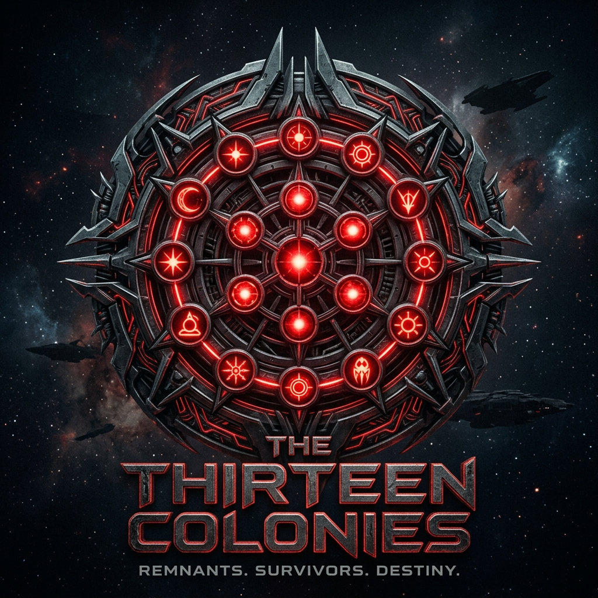

<div align="center">
  
  <h1>Cylon Images</h1>
  <p><em>By your command.</em></p>
</div>

This repository builds artifacts for the Cylon Resurrection Platform in two layers:

| Directory | Target | Output |
|---|---|---|
| [`container/`](container/) | Firecracker **microVM** guest | `vmlinux`, OCI rootfs → GHCR |
| [`multipass/`](multipass/) | **Resurrection-node** host OS | Multipass cloud-init + clones |

> **Kernel note:** Firecracker guest configs — [firecracker guest_configs](https://github.com/firecracker-microvm/firecracker/tree/main/resources/guest_configs)

## Quick start

```bash
# Repo root — all recipes via import
just --list

# MicroVM container artifacts
just build-kernel
just build-rootfs          # needs sibling ../cylon-skills
just push-rootfs-minimal   # ms02 dev registry

# Multipass resurrection nodes
just build-base
just clone-node 1
```

## CI

| Workflow | Path filter | Publishes |
|---|---|---|
| [`kernel.yml`](.github/workflows/kernel.yml) | `container/kernel/**` | `ghcr.io/.../cylon-kernel:6.1.102` |
| [`rootfs.yml`](.github/workflows/rootfs.yml) | `container/rootfs/**` | `ghcr.io/.../cylon-rootfs-ubuntu:latest` |

Rootfs CI checks out `microscaler/cylon-skills` into `container/rootfs/ubuntu/cylon-skills-registry` before `docker build`.

## The Thirteen Personalities

> *There are many copies. And they have a plan.*

The full Ubuntu rootfs (`container/rootfs/ubuntu/`) bakes the cylon-skills registry for 13 operational identities. See [`container/rootfs/ubuntu/Dockerfile`](container/rootfs/ubuntu/Dockerfile).
